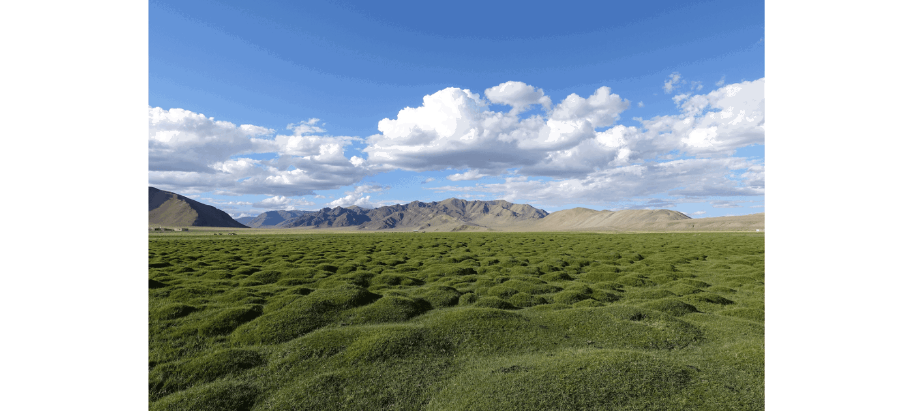
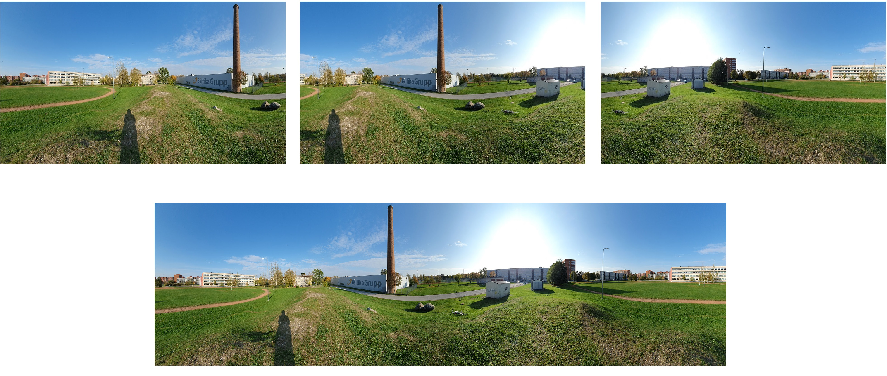
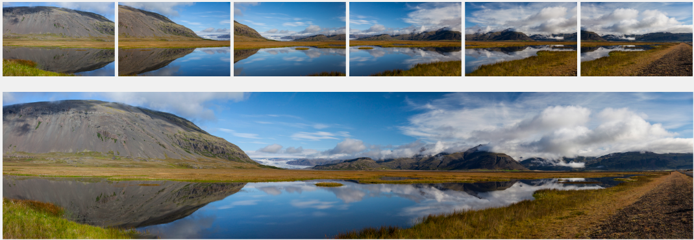

<h1 align="left"> Image-Panorama-Stitching </h1>

 
The main objective of this project is to detect discriminating features in an image and find the best matching features in other images. Because features should be reasonably invariant to translation, rotation, and illumination.

<!-- TABLE OF CONTENTS -->
<h2 id="table-of-contents"> Table of Contents</h2>
  <ol>
    <li><a href="#prerequisites"> Prerequisites </a></li>
    <li><a href="#DesignFeatureDetection"> Design a Feature Detection </a></li>
      <ul>
        <li><a href="#FeatureDetection"> Feature Detection </a></li>
        <li><a href="#FeatureDescription"> Feature Description </a></li>
        <li><a href="#FeatureMatching"> Feature Matching </a></li>
      </ul>
    <li><a href="#results"> Results </a></li>
    <li><a href="#reference"> Reference </a></li>
    <li><a href="#credits"> Credits </a></li>
  </ol>

<!--  -->

<!-- PREREQUISITES -->
<h2 id="prerequisites">Prerequisites</h2>

  
  
  
  
  

 1. Open a `Command Prompt` (NOT `Windows PowerShell`) or a `Terminal`
 2. Create a conda environment `conda create -n is python=3.6.6 -y`
 3. Activate this environment `activate is` (Windows) or `source activate is` (Linux/macOS)
 4. Install the following packages:  
      * <a href="https://www.python.org/" target="_blank">Python (3.6)</a>
      * <a href="https://opencv.org/" target="_blank">OpenCV (4.4.0)</a> - `pip install opencv==4.0.0`
      * <a href="https://jupyter.org/" target="_blank">Jupyter (4.7.1)</a> - `pip install notebook`

<!-- Design Feature Detection -->
<h2 id="DesignFeatureDetection"> Design Feature Detection </h2>

This involves three steps: feature detection, feature description, and feature matching.

 

<!-- Feature Detection -->
<h3 id="FeatureDetection"> Feature Detection </h3>

In this step, we will identify points of interest in the image using the Harris corner detection method. The steps are as follows:
      * For each point in the image, we consider a window of pixels around that point.
      * We compute the Harris matrix H for that point, defined as:

 
  

where the summation is over all pixels(u,v) in the window. The weights w(.,.) should be chosen to be circularly symmetric (for rotation invariance). A common choice is to use a 3x3 or 5x5 Gaussian mask. 

<!-- Feature Description -->
<h3 id="FeatureDescription"> FeatureDescription </h3>

Now that we have identified points of interest, the next step is to come up with a descriptor for the feature centered at each interest point, and rotational invariance should be taken into account in this step. This descriptor will be the representation we’ll use to compare features in different images to see if they match.

 

<!-- Feature Matching -->
<h3 id="FeatureMatching"> Feature Matching </h3>

Now that we have detected and described the features, the next step is to match them, i.e., given a feature in one image, find the best matching feature in one or more other images. This part of the feature detection and matching component is mainly designed to help testing out the feature descriptor. Two distance measures you should implement are:
      * A threshold on the match score. This is called the SSD distance.
      * (score of the best feature match)/(score of the second best feature match). This is called the "ratio test".

 

<!-- Results -->
<h2 id="Results"> Results </h2>

<h3 id="case1"> Case 1 </h3>

 
  

<h3 id="case2"> Case 2 </h3>

 
  

<!-- REFERENCES -->
<h2 id="reference"> References</h2>

<!-- CREDITS -->
<h2 id="credits"> Credits</h2>

Mohammad Amin Shamshiri

